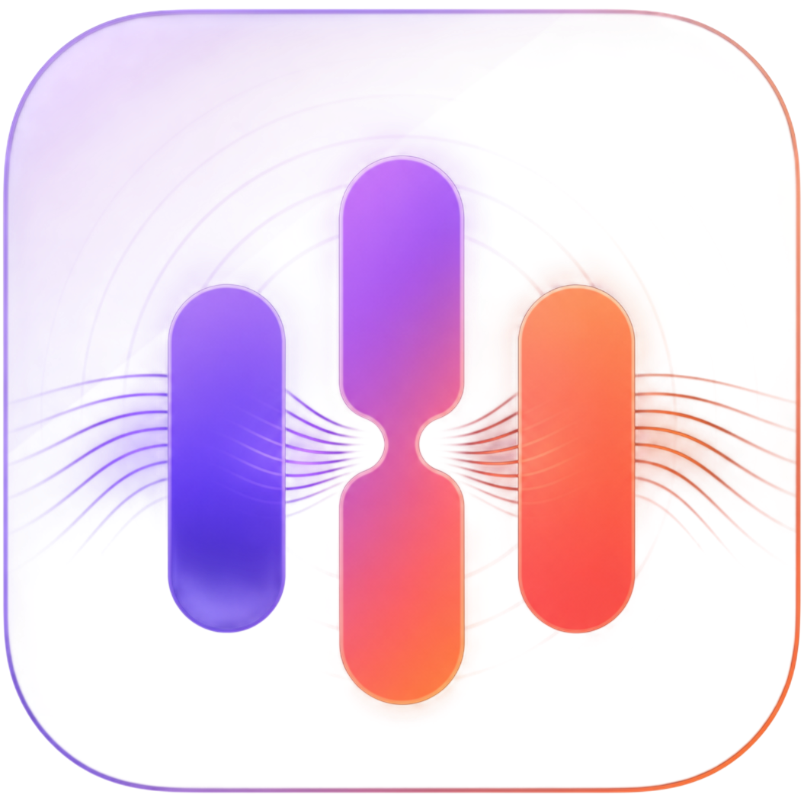

# LyraNest（律巢）

<p align="center">
  
</p>

<p align="center">一套面向个人 NAS、家庭服务器与局域网音乐库的自托管音乐服务。</p>

<p align="center">
  <a href="https://github.com/WHWgogogo/LyraNest/releases/latest"></a>
  <a href="https://github.com/WHWgogogo/LyraNest/releases/latest"></a>
  <a href="https://github.com/WHWgogogo/LyraNest/releases/latest/download/docker-compose.yml"></a>
</p>

<p align="center">
  <a href="https://github.com/WHWgogogo/LyraNest/releases/latest">下载最新版</a> ·
  <a href="#docker-compose-部署">Docker 部署</a> ·
  <a href="releases/0.1.8/CHANGELOG.md">更新日志</a> ·
  <a href="https://github.com/WHWgogogo/LyraNest-Community">开源社区版</a>
</p>

> **发行版说明**：此仓库用于发布 LyraNest 的客户端安装包、Docker 部署配置与更新记录，不包含完整版本源代码。若需要开源、可自行构建的基础版本，请前往 [LyraNest Community](https://github.com/WHWgogogo/LyraNest-Community)。

将音乐文件保存在自己的服务器、NAS 或电脑中，即可通过 Web、Windows 和 Android 客户端管理、播放并同步个人音乐库。

当前稳定版本：`0.1.8`

## 功能简介

- **多端音乐库**：Web、Windows、Android 共用服务端曲库、收藏、歌单与播放队列。
- **完整播放体验**：歌词展示与逐曲偏移调整、桌面歌词、播放模式、睡眠定时、播放列表定位。
- **离线下载**：下载歌曲、封面与歌词，在离线状态下浏览并播放已下载内容。
- **发现与报告**：每日推荐、猜你喜欢、听歌排行、听歌热力图与个人听歌统计。
- **曲库管理**：搜索、排序、批量操作、专辑与艺术家浏览，以及元数据刮削。
- **轻量部署**：Docker Compose 一键部署，支持音乐目录、数据目录、端口和内存限制配置。

## 界面预览

### 网页端

<p align="center">
  
  
  
</p>

<p align="center">
  
  
  
</p>

<p align="center">
  
  
  
</p>

### Android 移动端

<p align="center">
  
  
  
</p>

<p align="center">
  
  
  
</p>

<p align="center">
  
  
  
</p>

<p align="center">
  
  
  
</p>

<p align="center">
  
  
  
</p>

<p align="center">
  
  
  
</p>

<p align="center">
  
  
  
</p>

<p align="center">
  
  
</p>

### Windows 桌面端

<p align="center">
  
  
  
</p>

<p align="center">
  
</p>

## 获取客户端与服务端

请前往 [GitHub 最新发行版](https://github.com/WHWgogogo/LyraNest/releases/latest) 下载对应平台的文件。该链接会在新版本发布后自动指向最新稳定版：

| 文件 | 说明 |
| --- | --- |
| Android ARM64 APK | Android 手机、平板客户端 |
| Windows x64 ZIP | Windows 桌面客户端 |
| `LyraNest-0.1.8-fnos-x86.fpk` | 飞牛 fnOS x86 原生安装包（NAS 用户推荐） |
| `docker-compose.yml` | Docker Compose 部署配置 |
| `LyraNest.env.example` | Docker 环境变量示例 |
| `SHA256SUMS.txt` | 发行文件 SHA-256 校验值 |
| `SHA256SUMS-fnOS.txt` | 飞牛 fnOS FPK 的 SHA-256 校验值 |

## 飞牛 fnOS 原生 FPK 安装（推荐）

飞牛 NAS 用户推荐从 [GitHub 最新发行版](https://github.com/WHWgogogo/LyraNest/releases/latest) 下载 `LyraNest-0.1.8-fnos-x86.fpk`，然后在飞牛应用中心使用“手动安装”导入该文件。

安装后，在应用设置中授权音乐目录并启动 LyraNest。默认使用飞牛统一网关访问：在你平时打开飞牛管理界面的局域网地址后追加 `/app/lyranest`。

如需独立局域网端口，可在 LyraNest 应用设置填写 `1024–65535` 的自定义端口，保存后重启应用，再通过 `http://<飞牛局域网地址>:<端口>/` 访问。留空则只保留飞牛网关入口；独立端口仅建议用于可信局域网，不要配置公网端口映射。

## Docker 镜像

服务端镜像统一命名为：

```text
ghcr.io/whwgogogo/lyranest-server:0.1.8
```

如需跟随后续发行，可将 Compose 中的 `LYRANEST_VERSION` 改为已发布的明确版本号；生产环境建议固定具体版本，便于回滚。

## Docker Compose 部署

根目录的 [`docker-compose.yml`](docker-compose.yml) 已附带中文注释，完整配置如下；可直接保存为同名文件后执行部署：

```yaml
# LyraNest 服务端 Docker Compose 配置
# 建议复制 .env.example 为 .env，然后优先在 .env 中修改参数。

services:
  lyranest:
    # 镜像版本由 LYRANEST_VERSION 控制。
    # 固定版本示例：0.1.8；自动跟随最新版：latest（不是 least）。
    image: ghcr.io/whwgogogo/lyranest-server:${LYRANEST_VERSION:-0.1.8}
    container_name: lyranest
    restart: unless-stopped
    init: true

    # 当前发行镜像为 Linux AMD64；ARM 服务器暂时不能直接使用此镜像。
    platform: linux/amd64
    pull_policy: always

    # 修改为服务器当前用户的 UID/GID，可通过 id -u 和 id -g 查询。
    user: ${PUID:-1000}:${PGID:-1000}

    # 可按服务器内存大小调整限制；默认最大 256 MB，预留 128 MB。
    mem_limit: ${SERVER_MEMORY_LIMIT:-256m}
    mem_reservation: ${SERVER_MEMORY_RESERVATION:-128m}
    security_opt:
      - no-new-privileges:true

    environment:
      # 容器内部监听端口，一般不需要修改。
      SERVER_ADDR: :8080
      MUSIC_LIBRARY_DIR: /music
      MUSIC_DATA_DIR: /data
      GOMEMLIMIT: ${GOMEMLIMIT:-192MiB}
      GOGC: ${GOGC:-100}
      MUSICBRAINZ_USER_AGENT: ${MUSICBRAINZ_USER_AGENT:-LyraNest-server-0.1.8 (+https://github.com/WHWgogogo/LyraNest)}
      MUSICBRAINZ_BASE_URL: ${MUSICBRAINZ_BASE_URL:-https://musicbrainz.org}
      MUSICBRAINZ_TIMEOUT: ${MUSICBRAINZ_TIMEOUT:-20s}
      LOG_LEVEL: ${LOG_LEVEL:-info}
      SHUTDOWN_TIMEOUT: ${SHUTDOWN_TIMEOUT:-10s}
      AUTH_SESSION_TTL: ${AUTH_SESSION_TTL:-24h}
      HTTP_PROXY: ${HTTP_PROXY:-}
      HTTPS_PROXY: ${HTTPS_PROXY:-}
      NO_PROXY: ${NO_PROXY:-}

    ports:
      # 左侧是主机访问端口，右侧 8080 是容器端口。
      # 例如 SERVER_PORT=9090 时，访问地址为 http://服务器地址:9090。
      - ${SERVER_PORT:-8080}:8080

    volumes:
      # 冒号左侧是主机目录，可以改成绝对路径；右侧容器目录不要修改。
      # 音乐目录示例：/mnt/music:/music:rw 或 /volume1/music:/music:rw。
      - ${MUSIC_LIBRARY_HOST_DIR:-./music}:/music:rw
      # 数据目录保存账号、收藏、歌单和服务端状态。
      - ${DATA_DIR:-./data}:/data:rw
      # 缓存目录保存运行缓存。
      - ${CACHE_DIR:-./cache}:/cache:rw

    healthcheck:
      test: ["CMD", "/usr/local/bin/music-player-server", "healthcheck"]
      interval: 30s
      timeout: 5s
      retries: 5
      start_period: 30s
```

### 1. 准备目录与配置

```bash
git clone https://github.com/WHWgogogo/LyraNest.git
cd LyraNest
mkdir -p music data cache
cp .env.example .env
```

根目录的 [`docker-compose.yml`](docker-compose.yml) 已附带中文注释。可在 `.env` 中按需修改以下项目：

| 配置项 | 默认值 | 用途 |
| --- | --- | --- |
| `SERVER_PORT` | `8080` | 主机对外访问端口，例如 `18080` |
| `MUSIC_LIBRARY_HOST_DIR` | `./music` | 主机音乐目录，可替换为绝对路径 |
| `DATA_DIR` | `./data` | 用户、收藏、歌单和服务端数据目录 |
| `CACHE_DIR` | `./cache` | 服务端缓存目录 |
| `PUID` / `PGID` | `1000` | 容器访问挂载目录时使用的主机用户 ID |
| `LYRANEST_VERSION` | `0.1.8` | 服务端镜像版本 |

### 2. 启动与检查

```bash
docker compose pull
docker compose up -d
docker compose ps
curl http://127.0.0.1:8080/health
```

首次启动后，可使用 `http://服务器地址:8080` 打开网页端；Windows 与 Android 客户端填写相同的服务器地址并登录即可。

## 版本与校验

- 每个版本都保留独立 GitHub Release 与附件，不会覆盖旧版本。
- README 的下载入口使用 GitHub `releases/latest`，始终指向最新稳定发行。
- 下载完成后可用对应的 `SHA256SUMS.txt` 或 `SHA256SUMS-fnOS.txt` 校验文件完整性。
- 详细更新内容请查看对应版本的 `CHANGELOG.md`。

## 相关项目

- [LyraNest Community](https://github.com/WHWgogogo/LyraNest-Community)：MIT 许可的开源基础版本。
- [LyraNest Releases](https://github.com/WHWgogogo/LyraNest/releases/latest)：完整发行版的最新下载页。
