# LyraNest（律巢）

<p align="center">
  
</p>

<p align="center">一套面向个人 NAS、家庭服务器与局域网音乐库的自托管音乐服务。</p>

<p align="center">
  <a href="https://github.com/WHWgogogo/LyraNest/releases/latest"></a>
  <a href="https://github.com/WHWgogogo/LyraNest/releases/latest"></a>
  <a href="https://github.com/WHWgogogo/LyraNest/releases/latest/download/docker-compose.yml"></a>
</p>

<p align="center">
  <a href="https://github.com/WHWgogogo/LyraNest/releases/latest">下载最新版</a> ·
  <a href="#docker-compose-部署">Docker 部署</a> ·
  <a href="releases/0.2.1/CHANGELOG.md">更新日志</a> ·
  <a href="https://github.com/WHWgogogo/LyraNest-Community">开源社区版</a>
</p>

> **发行版说明**：此仓库用于发布 LyraNest 的客户端安装包、Docker 部署配置与更新记录，不包含完整版本源代码。若需要开源、可自行构建的基础版本，请前往 [LyraNest Community](https://github.com/WHWgogogo/LyraNest-Community)。

将音乐文件保存在自己的服务器、NAS 或电脑中，即可通过 Web、Windows 和 Android 客户端管理、播放并同步个人音乐库。

当前稳定版本：`0.2.1`

交流 QQ 群：`700454910`

## 0.2.1 更新摘要

- **多用户与权限管理**：支持管理员和普通成员、按曲库分配访问权限；每位用户拥有独立收藏、歌单、播放记录和隐藏歌曲。
- **TV 与扫码登录**：新增独立 Android TV 客户端，支持扫码登录、曲库切换、完整播放队列和遥控器焦点导航。
- **全新界面与浏览方式**：新增浅色主题、按目录浏览、局域网服务发现、多账号切换、曲库卡片和自定义歌单封面。
- **大曲库与刮削优化**：升级数据库与批量刮削流程，优化封面候选、自动应用、逐字歌词获取和大曲库性能。
- **部署增强**：Docker Compose 支持挂载 `/music`、`/music1`、`/music2` 等多个音乐目录，fnOS 新增目录后可自动重启。
- **正式部署包**：Windows、Android、Android TV、fnOS 与 Docker Linux AMD64 发行包统一升级至 `0.2.1`。

完整升级注意事项和更新内容请查看 [`releases/0.2.1/CHANGELOG.md`](releases/0.2.1/CHANGELOG.md)。

## 功能简介

- **多端音乐库**：Web、Windows、Android 共用服务端曲库、收藏、歌单与播放队列。
- **完整播放体验**：歌词展示与逐曲偏移调整、桌面歌词、播放模式、睡眠定时、播放列表定位。
- **离线下载**：下载歌曲、封面与歌词，在离线状态下浏览并播放已下载内容。
- **发现与报告**：每日推荐、猜你喜欢、听歌排行、听歌热力图与个人听歌统计。
- **曲库管理**：搜索、排序、批量操作、专辑与艺术家浏览，以及元数据刮削。
- **轻量部署**：Docker Compose 一键部署，支持音乐目录、数据目录、端口和内存限制配置。

## 界面预览

### 0.2.1 新版 UI

<p align="center">
  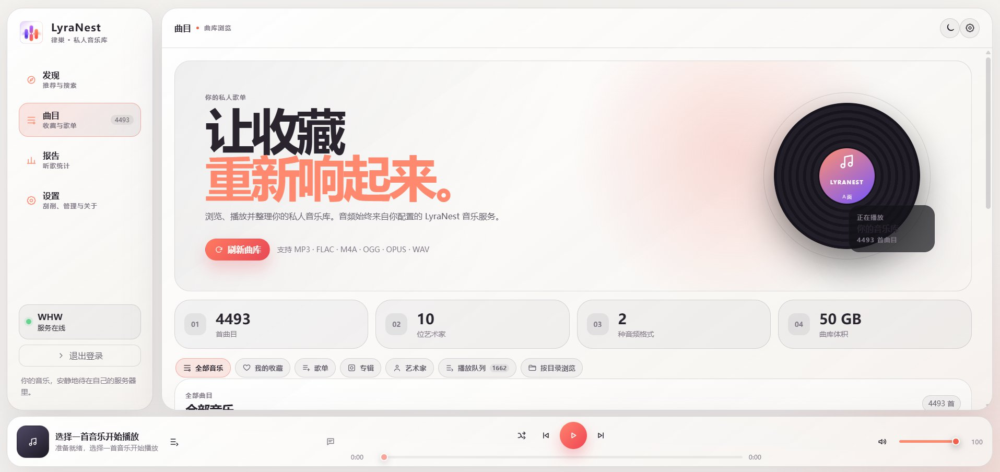
  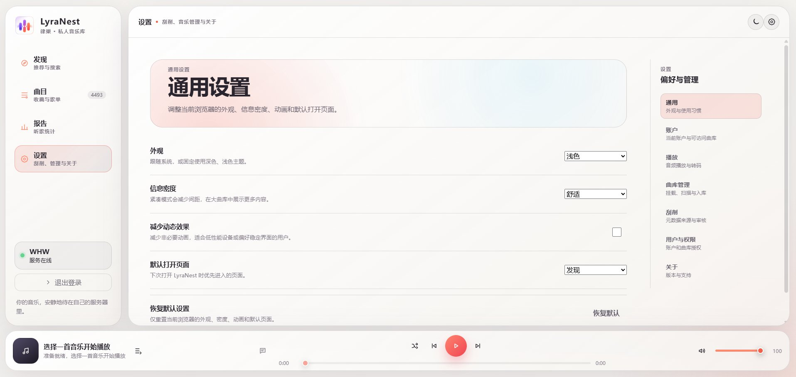
  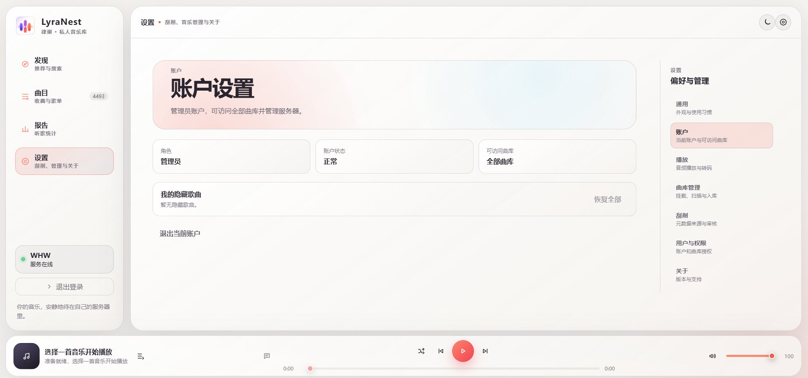
</p>

<p align="center">
  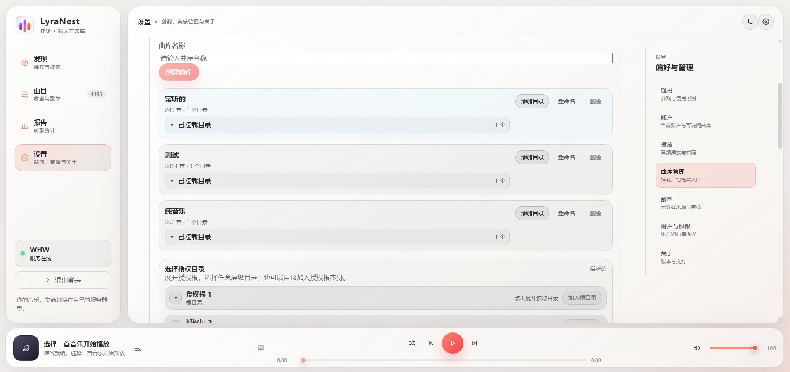
  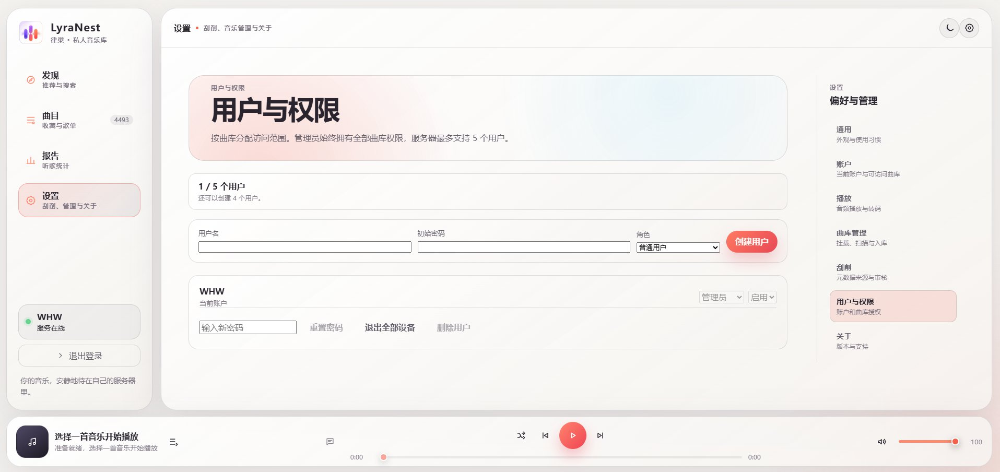
  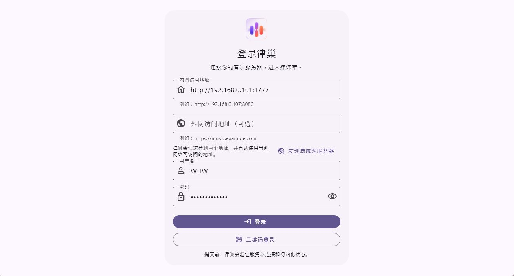
</p>

<p align="center">
  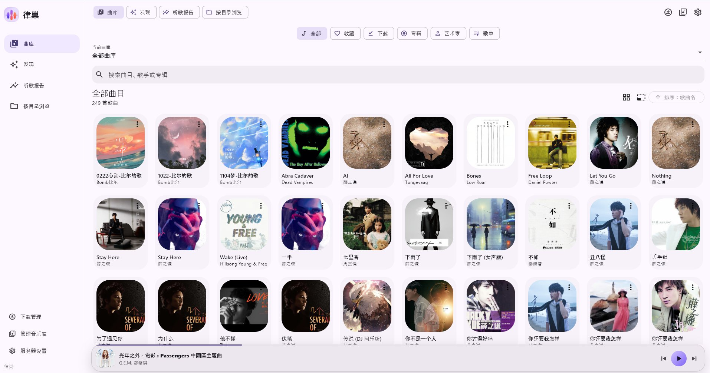
  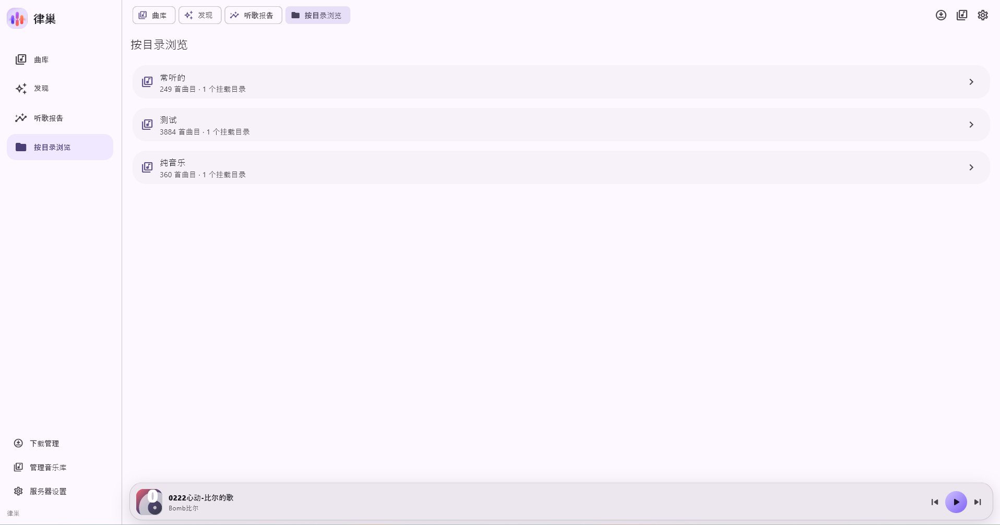
  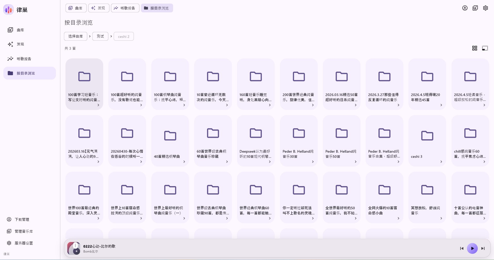
</p>

<p align="center">
  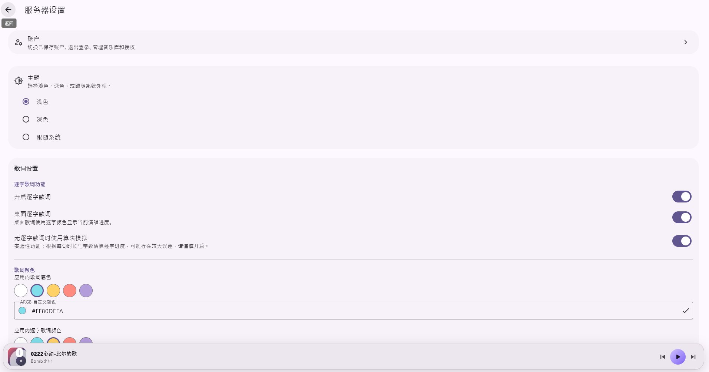
  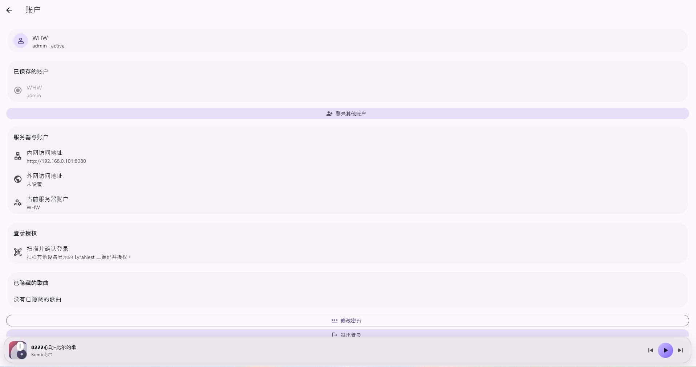
  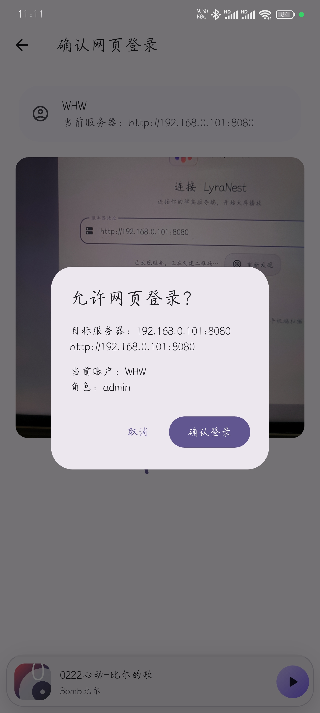
</p>

<p align="center">
  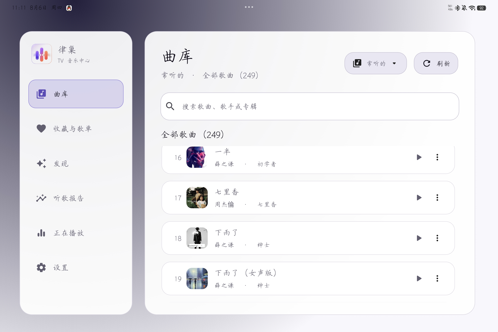
</p>

### 网页端

<p align="center">
  
  
  
</p>

<p align="center">
  
  
  
</p>

<p align="center">
  
  
  
</p>

### Android 移动端

<p align="center">
  
  
  
</p>

<p align="center">
  
  
  
</p>

<p align="center">
  
  
  
</p>

<p align="center">
  
  
  
</p>

<p align="center">
  
  
  
</p>

<p align="center">
  
  
  
</p>

<p align="center">
  
  
  
</p>

<p align="center">
  
  
</p>

### Windows 桌面端

<p align="center">
  
  
  
</p>

<p align="center">
  
</p>

## 获取客户端与服务端

请前往 [GitHub 最新发行版](https://github.com/WHWgogogo/LyraNest/releases/latest) 下载对应平台的文件。该链接会在新版本发布后自动指向最新稳定版：

| 文件 | 说明 |
| --- | --- |
| `LyraNest-0.2.1-android-arm64.apk` | Android 手机、平板客户端 |
| `LyraNest-TV-0.2.1-android-arm64.apk` | Android TV 客户端 |
| `LyraNest-0.2.1-windows-x64.zip` | Windows 桌面客户端 |
| `LyraNest-0.2.1-fnos-x86.fpk` | 飞牛 fnOS x86 原生安装包（NAS 用户推荐） |
| `LyraNest-v0.2.1-docker-amd64.tar.gz` | Docker Linux AMD64 离线部署包 |
| `docker-compose.yml` | Docker Compose 部署配置 |
| `LyraNest.env.example` | Docker 环境变量示例 |
| `SHA256SUMS.txt` | 发行文件 SHA-256 校验值 |
| `SHA256SUMS-fnOS.txt` | 飞牛 fnOS FPK 的 SHA-256 校验值 |

## 飞牛 fnOS 原生 FPK 安装（推荐）

飞牛 NAS 用户推荐从 [GitHub 最新发行版](https://github.com/WHWgogogo/LyraNest/releases/latest) 下载 `LyraNest-0.2.1-fnos-x86.fpk`，然后在飞牛应用中心使用“手动安装”导入该文件。

安装后，在应用设置中授权音乐目录并启动 LyraNest。默认使用飞牛统一网关访问：在你平时打开飞牛管理界面的局域网地址后追加 `/app/lyranest`。

如需独立局域网端口，可在 LyraNest 应用设置填写 `1024–65535` 的自定义端口，保存后重启应用，再通过 `http://<飞牛局域网地址>:<端口>/` 访问。留空则只保留飞牛网关入口；独立端口仅建议用于可信局域网，不要配置公网端口映射。

## Docker 镜像

服务端镜像统一命名为：

```text
ghcr.io/whwgogogo/lyranest-server:0.2.1
```

生产环境请固定 `LYRANEST_VERSION=0.2.1`。同时发布 `0.2.1` 与 `latest` 标签，其中 `latest` 指向当前稳定版 `0.2.1`。

> 如果 Docker 报出 `proxyconnect tcp ... 127.0.0.1:27897: connect: connection refused`，请移除 Docker 守护进程中失效的 HTTP/HTTPS 代理后再拉取。若设备不能联网，可使用本次发行的 Docker 离线包并按下方命令导入和标记镜像。

## Docker Compose 部署

根目录的 [`docker-compose.yml`](docker-compose.yml) 与发行附件使用同一个正式镜像和版本：

```yaml
services:
  lyranest:
    image: ghcr.io/whwgogogo/lyranest-server:${LYRANEST_VERSION:-0.2.1}
    container_name: lyranest
    restart: unless-stopped
    init: true
    platform: linux/amd64
    mem_limit: ${SERVER_MEMORY_LIMIT:-256m}
    mem_reservation: ${SERVER_MEMORY_RESERVATION:-128m}
    security_opt:
      - no-new-privileges:true
    environment:
      SERVER_ADDR: :8080
      MUSIC_LIBRARY_DIR: /music
      MUSIC_DATA_DIR: /data
      MUSIC_CACHE_DIR: /cache
      GOMEMLIMIT: ${GOMEMLIMIT:-192MiB}
      GOGC: ${GOGC:-100}
      MEDIA_EXTRACT_CONCURRENCY: ${MEDIA_EXTRACT_CONCURRENCY:-4}
      MEDIA_SCRAPE_CONCURRENCY: ${MEDIA_SCRAPE_CONCURRENCY:-2}
      MUSIC_LOW_MEMORY: ${MUSIC_LOW_MEMORY:-0}
      MUSICBRAINZ_USER_AGENT: ${MUSICBRAINZ_USER_AGENT:-LyraNest/0.2.1 (+https://github.com/WHWgogogo/LyraNest)}
      MUSICBRAINZ_BASE_URL: ${MUSICBRAINZ_BASE_URL:-https://musicbrainz.org}
      MUSICBRAINZ_TIMEOUT: ${MUSICBRAINZ_TIMEOUT:-20s}
      SCRAPER_PROVIDER_CONFIG: ${SCRAPER_PROVIDER_CONFIG:-}
      LOG_LEVEL: ${LOG_LEVEL:-info}
      SHUTDOWN_TIMEOUT: ${SHUTDOWN_TIMEOUT:-10s}
      AUTH_SESSION_TTL: ${AUTH_SESSION_TTL:-24h}
      LYRANEST_DISCOVERY: ${LYRANEST_DISCOVERY:-1}
      HTTP_PROXY: ${HTTP_PROXY:-}
      HTTPS_PROXY: ${HTTPS_PROXY:-}
      NO_PROXY: ${NO_PROXY:-}
    ports:
      - ${SERVER_PORT:-8080}:8080
    volumes:
      - ${MUSIC_LIBRARY_HOST_DIR:-./music}:/music:ro
      # - /path/to/second-library:/music1:ro
      - ${DATA_DIR:-./data}:/data:rw
      - ${CACHE_DIR:-./cache}:/cache:rw
    healthcheck:
      test: ["CMD", "/usr/local/bin/music-player-server", "healthcheck"]
      interval: 30s
      timeout: 5s
      retries: 5
      start_period: 90s
```

如需挂载多个音乐目录，在 `volumes` 中继续添加 `/music1`、`/music2` 等只读挂载；服务端会自动发现这些目录。

### 1. 在线部署

```bash
mkdir -p lyranest && cd lyranest
curl -fLO https://github.com/WHWgogogo/LyraNest/releases/latest/download/docker-compose.yml
curl -fL https://github.com/WHWgogogo/LyraNest/releases/latest/download/LyraNest.env.example -o .env
mkdir -p music data cache
docker compose pull
docker compose up -d
```

根目录的 [`docker-compose.yml`](docker-compose.yml) 已附带中文注释。可在 `.env` 中按需修改以下项目：

| 配置项 | 默认值 | 用途 |
| --- | --- | --- |
| `SERVER_PORT` | `8080` | 主机对外访问端口，例如 `18080` |
| `MUSIC_LIBRARY_HOST_DIR` | `./music` | 主机音乐目录，可替换为绝对路径 |
| `DATA_DIR` | `./data` | 用户、收藏、歌单和服务端数据目录 |
| `CACHE_DIR` | `./cache` | 服务端缓存目录 |
| `LYRANEST_VERSION` | `0.2.1` | 固定使用的服务端镜像版本 |

### 2. GHCR 无法访问时离线部署

从 [GitHub 最新发行版](https://github.com/WHWgogogo/LyraNest/releases/latest) 下载 `LyraNest-v0.2.1-docker-amd64.tar.gz`，复制到目标设备后执行：

```bash
mkdir -p lyranest && tar -xzf LyraNest-v0.2.1-docker-amd64.tar.gz -C lyranest
cd lyranest
cp .env.example .env
docker build --pull=false -f Dockerfile.offline -t ghcr.io/whwgogogo/lyranest-server:0.2.1 .
mkdir -p music data cache
docker compose up -d --pull never
```

离线包内含 Linux AMD64 服务端、CA 证书、Compose、环境变量示例和 `scratch` Dockerfile，构建过程不访问任何镜像仓库。离线部署时不要执行 `docker compose pull`；如果 NAS 图形界面会强制拉取镜像，请关闭“启动前拉取镜像”选项。

### 3. 检查服务

```bash
docker compose ps
curl http://127.0.0.1:8080/health
```

首次启动后，可使用 `http://服务器地址:8080` 打开网页端；Windows 与 Android 客户端填写相同的服务器地址并登录即可。

## 版本与校验

- 每个版本都保留独立 GitHub Release 与附件，不会覆盖旧版本。
- README 的下载入口使用 GitHub `releases/latest`，始终指向最新稳定发行。
- 下载完成后可用对应的 `SHA256SUMS.txt` 或 `SHA256SUMS-fnOS.txt` 校验文件完整性。
- 详细更新内容请查看对应版本的 `CHANGELOG.md`。

## 相关项目

- [LyraNest Community](https://github.com/WHWgogogo/LyraNest-Community)：MIT 许可的开源基础版本。
- [LyraNest Releases](https://github.com/WHWgogogo/LyraNest/releases/latest)：完整发行版的最新下载页。
